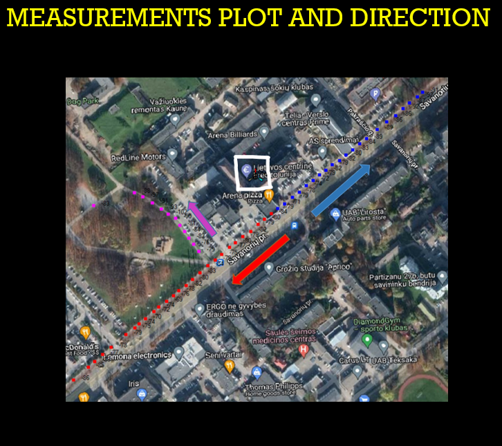
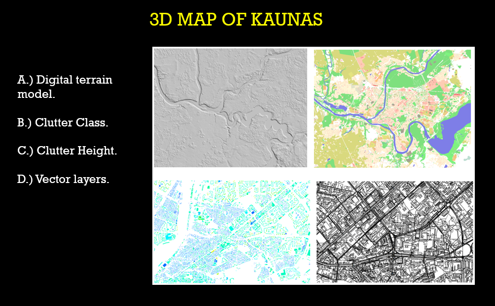
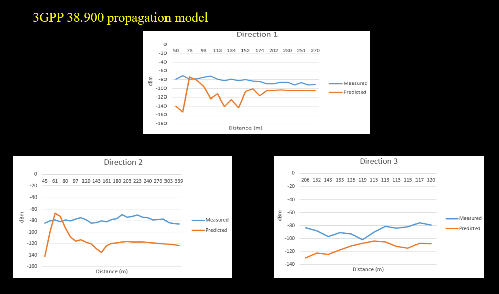
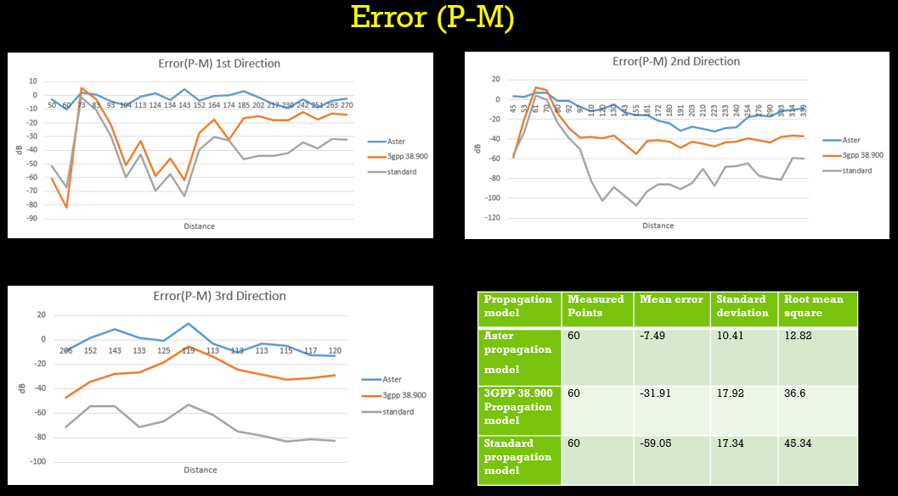

 

  

  <h3 align="center">INVESTIGATION OF 5G RADIO WAVE PROPAGATION IN MACRO CELL ENVIRONMENTS
  </h3>
    

    Master Thesis
     
     
  

## About The Project

 

The Aim of the project is to propose and investigate a propagation model that is suitable for 5G New Radio implementation in Macro cell environments. By analyzing the different signal quality parameters like RSRP,RSRQ,SINR, the suitable propagation model can be selected. 
The following tasks are performed in order to achieve the Aim of the research project.

•	Initially, analyze the different existing propagation models sitable for 5G New Radio and operating frequency.

•	Analyze the 5G New Radio parameters(PCI, PSS, SSS, PBCH, DMRS) and signal quality parameters.(RSRP, RSRQ, SINR, RSSI).

•	Collect  the measurements of different parameters  near the base station .

•	Import these measured values into radio planning software and predict the values.

•	Perform the comparison of measured values and predicted values for different propagation models to find best suited model in macro cell environments.

•	Calibrate the proposed model by adjusting the correction coefficient.

 

## Illustration of work flow chart

 

 

 

## Measurement Plot and Directions

 
The 5G base station is located at Savanorių avenue 363, Kaunas is chosen to take practical measurements. The latest 5G phone Poco M3 Pro, which is compatible with 5G services in Lithuania is used. Different parameter values are noted at a different distances in three directions as shown in below figure. The coordinates of the tower location are 689494.22,6090141.7 WGS 84 / UTM zone 34N. The below figure shows the base station transmitter sectors direction angle.

 
 

 

 
 

## Measurement Graphs
 
Measured / practical 5G parameters readings.

 

 

 
 

## 3D Map of Kaunas
 
The 3D Map used for simulation purposes in the Atoll network planning tool should have four types of data, which are Digital Terrain Model, Clutter Class, Clutter height, and vector data for reference purposes. For the 5G New Radio prediction, the 3D map contains the data of environment where the 5G is deployed, Atoll can calculate the pathloss based on the environment data and to check the network access quality in particular area. This map data contains buildings and its height so that to check how the signal propagates in that environment.
To create these map data various open-source map creation software are used and some websites provide these necessary free satellite data for the creation of 3D maps.

 

 

 
 

## 5G Transmitter Details
 

In 2019-2021, Telia used Huawei AAU5613 5G transmitter antenna for the testing purpose. But due to security reasons, this transmitter antenna was replaced by an Ericsson transmitter antenna.
AIR 3278 B78K Ericsson antenna is used in all cities of Lithuania for 5G Network. In Lithuania 5G network services are already started for commercial purposes at 2100 MHz in some cities.

In Kaunas, the 5G tower at Savanorių avenue 363 is not commissioned for commercial purposes,
still testing is going on. The antenna is operated at 3.750 GHz (ARFCN 650000). 

 

 

 
 

## Aster Propagation Model Predictons
 
The measured value of RSRP is compared with the predicted value using Aster propagation model for all 3 direction.

 

 

 
 

## 3GPP 38.900 Propagation Model Predictions
 
The measured value of RSRP is compared with the predicted value using 3GPP 38.900 propagation model for all 3 direction.

 

 

 
 

## Standard Propagation Model Predictions
 
The measured value of RSRP is compared with the predicted value using standard propagation model for all 3 direction.

 

 

 
 

## Error(P-M)
 

All the propagation models and all directions Mean error, standard deviation and root mean square are compared. It is concluded that Aster propagation model mean error, standard deviation and root mean square are very low when compared to other propagation models.

 

 

 
 

## Coefficient Correction

 

Calibration can be done manually using the frequency, antenna height, etc. The aster model is a very expensive model in Atoll to find pathloss because the computation time is very fast and there is an option for automatic calibration of parameter coefficient when the necessary data is valid. From below figure, the initial value of the mean(M), standard deviation(std dev), and root mean square(RMS) values are compared with the calibrated value of the mean standard deviation and root mean square, it shows a significant improvement.

The results from the below figure shows before coefficient correction for all points, the values of mean(M), standard deviation(std dev) and Root mean quare(RMS) is significantly high. After calibrated the values reduced significantly, thus improving the proposed model.

 

 

 
 

## Conclusion
 

This research work presents the overview of investigation of 5G in a Macrocell environment. The main conclusions of all the tasks for the project experiment is presented in this chapter.
1. The 5G NR basic concept and the parameters were analyzed. The different propagation models which are suitable for 5G frequencies and other parameter were chosen and investigated deeply to understand the concept.
2. The latest 5G phone Poco M3 Pro, which is compatible with 5G services in Lithuania is used to take the real-time measurements for the 5G NR near the 5G base station that is located at Savanorių avenue 363, Kaunas. And all the 5G quality parameters (RSRP, RSRQ, SINR) are tabulated.
3. For the prediction purpose, the Kaunas city map is created in 3D format with a resolution of 1 m. The satellite map data is collected from the open street view website and the working area data are extracted from that website, by using photoshop, the extracted map data is converted into the compatible format to the Forsk Atoll. All the necessary 3D map data of Kaunas is imported into the RAN planning Atoll software. 
4. The walk test measurement data taken by the 5G phone is fed into the Atoll software to compare the measured data with predicted data. The different propagation model data is compared with the real-time measurement, the error value E is the difference between predicted and measured values. The propagation model which has a low error value is best suited for 5G NR deployment in a Macro environment.
5. By comparing the error values of different propagation models from figure and table value, Aster propagation mean error for total measured points is -7.49, which is significantly less than   the other two models. The  macro cell environment mode is used for prediction. Standard deviation (std dev) and Root mean square(RMS) values of Aster model is 10.41, 12.82 respectively is very low than 3GPP 38.900 model and standard model. The Aster propagation model is identified as best suited model for 5G in Macrocell environment with low mean error -7.49, Standard deviation 10.41 and Root mean square 12.82.
6. The calibration of  parameter coefficient is done to get better efficient in the proposed model.The propogation model coefficient are optimized for macro cell environment. Depending on the environments like micro or macro these coefficients of parameter changes accordingly. The standard deviation(-0.01) denotes how dispersed the values are, higher the value  means high dispersed. The RMS value denotes how far the values are different from one another, lower the value  the measured and predicted values are close.The Correlation coefficient value is 0.75 after calibration. It denotes the how predicted values differ from measured values and range from-1 to +1.

 

## Authors

 

* **Vignesh Raj Muthupandy** - *Electronics Engineering student*  -[Vignesh Raj Muthupandy](https://www.linkedin.com/in/vignesh-raj-muthupandy-68a0b41a3) - *Linkedin*

* **Assoc. prof. Dr. Vitas Grimaila** - *Supervisor* - [Assoc. prof. Dr. Vitas Grimaila](https://www.linkedin.com/in/vitas-grimaila-06b73240/) - *Linkedin*

